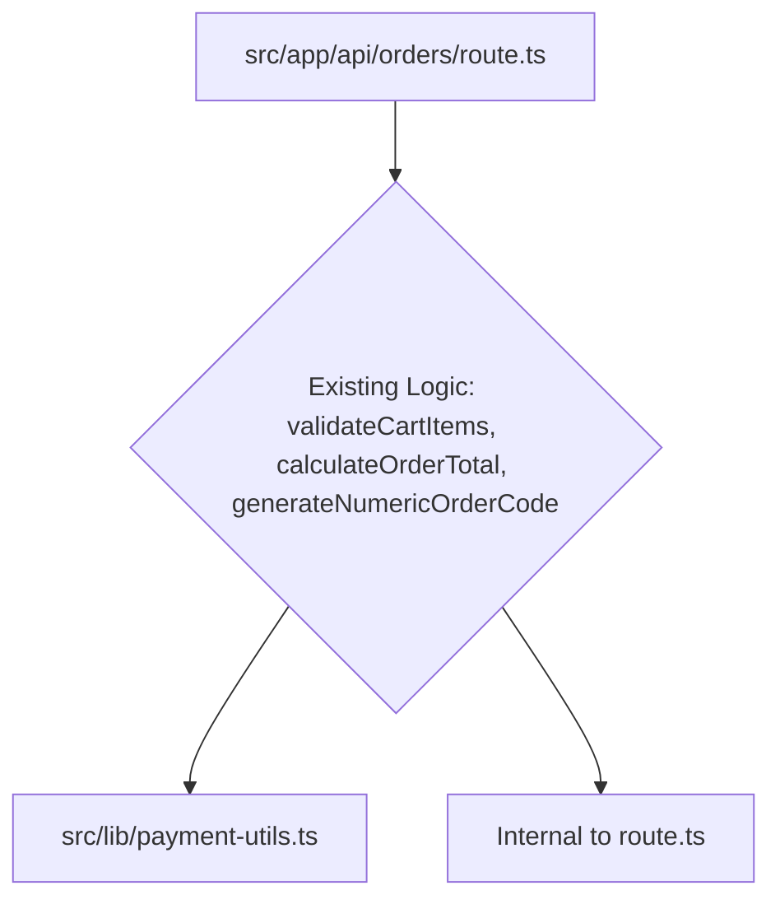

# Plan: 260214-extract-order-service - Extract Order Service from API Route

## Context Links
- Original API Route: /Users/macbookprom1/mekong-cli/apps/84tea/src/app/api/orders/route.ts
- Original Utility: /Users/macbookprom1/mekong-cli/apps/84tea/src/lib/payment-utils.ts
- Proposed New Service: /Users/macbookprom1/mekong-cli/apps/84tea/src/modules/commerce/order/order.service.ts
- Task ID: 6

## Overview
This plan details Phase 1 of the 84tea refactoring: extracting core order-related business logic from the Next.js API route (`src/app/api/orders/route.ts`) and `src/lib/payment-utils.ts` into a new dedicated service (`src/modules/commerce/order/order.service.ts`). This will decouple the business logic from the presentation layer and utility functions, making it more testable and reusable.

**Priority**: High
**Current Status**: Pending
**Brief Description**: Move `validateCartItems`, `calculateOrderTotal` and `generateNumericOrderCode` into `OrderService`. Update the API route to use the new service.

## Key Insights
- The `route.ts` currently contains direct business logic for order creation and validation.
- `payment-utils.ts` contains `validateCartItems` and `calculateOrderTotal` which are core to order processing.
- `generateNumericOrderCode` is a specific business rule for order codes.
- The new `OrderService` will encapsulate these functionalities, improving modularity and maintainability.

## Requirements
- Create `src/modules/commerce/order/order.service.ts`.
- Move `validateCartItems`, `calculateOrderTotal`, and `generateNumericOrderCode` to `OrderService`.
- Update `src/app/api/orders/route.ts` to import and use functions from `OrderService`.
- Ensure all types (`ValidatedItem`) are correctly moved or re-exported.
- Maintain existing functionality and behavior without introducing regressions.
- Ensure the API route remains functional after refactoring.

## Architecture
- **Before**: API Route directly calls utility functions and implements business logic.
- **After**: API Route acts as a thin controller, delegating business logic to `OrderService`. `OrderService` will handle validation and order code generation.



```mermaid
graph TD
    A[src/app/api/orders/route.ts] --> E[src/modules/commerce/order/order.service.ts]
    E --> C[src/lib/payment-utils.ts] (remove validateCartItems, calculateOrderTotal)
    E --> F[Supabase Client]
    E --> G[Order Code Generation Logic]
```

## Related Code Files
- **To Create**:
    - `/Users/macbookprom1/mekong-cli/apps/84tea/src/modules/commerce/order/order.service.ts`
- **To Modify**:
    - `/Users/macbookprom1/mekong-cli/apps/84tea/src/app/api/orders/route.ts`
    - `/Users/macbookprom1/mekong-cli/apps/84tea/src/lib/payment-utils.ts` (remove moved functions)
    - `/Users/macbookprom1/mekong-cli/apps/84tea/src/lib/validation.ts` (if `orderSchema` needs to be moved/adjusted - *this will be handled in Phase 2, but keep in mind*)

## Implementation Steps

### Step 1: Create the new `order.service.ts` file and define `OrderService`
1. Create the directory: `/Users/macbookprom1/mekong-cli/apps/84tea/src/modules/commerce/order/`
2. Create the file: `/Users/macbookprom1/mekong-cli/apps/84tea/src/modules/commerce/order/order.service.ts`
3. Add a basic class structure for `OrderService`.

### Step 2: Move `generateNumericOrderCode` to `order.service.ts`
1. Cut the `generateNumericOrderCode` function from `src/app/api/orders/route.ts` (lines 32-36).
2. Paste it into `OrderService` in `src/modules/commerce/order/order.service.ts` as a static method or a method of an instance.

### Step 3: Move `validateCartItems` and `calculateOrderTotal` to `order.service.ts`
1. Open `src/lib/payment-utils.ts`.
2. Extract `validateCartItems` and `calculateOrderTotal` functions, including their dependencies (like `ValidatedItem` interface) and move them to `src/modules/commerce/order/order.service.ts`.
3. Modify `order.service.ts` to include these functions and handle their dependencies. If `ValidatedItem` is needed outside, it should be re-exported from `order.service.ts` or defined directly within it.
4. Update imports in `order.service.ts` (e.g., `getSupabaseClient` if used inside).

### Step 4: Update `src/app/api/orders/route.ts` to use `OrderService`
1. Import `OrderService` (or its static methods) into `src/app/api/orders/route.ts`.
2. Replace calls to `validateCartItems`, `calculateOrderTotal`, and `generateNumericOrderCode` with calls to the corresponding methods from `OrderService`.
3. Remove the now unused import `import { validateCartItems, calculateOrderTotal, ValidatedItem } from "@/lib/payment-utils";` from `route.ts`.

### Step 5: Clean up `src/lib/payment-utils.ts`
1. Remove the moved `validateCartItems`, `calculateOrderTotal` and `ValidatedItem` from `src/lib/payment-utils.ts`.
2. Ensure no other files depend on these functions from `payment-utils.ts` (though for now, we only expect `route.ts`).

## Todo List
- [ ] Create `/Users/macbookprom1/mekong-cli/apps/84tea/src/modules/commerce/order/order.service.ts`
- [ ] Move `generateNumericOrderCode` from `route.ts` to `order.service.ts`
- [ ] Move `validateCartItems` and `calculateOrderTotal` (and `ValidatedItem`) from `payment-utils.ts` to `order.service.ts`
- [ ] Update `route.ts` to use `OrderService` methods
- [ ] Clean up `payment-utils.ts`

## Success Criteria
- `src/app/api/orders/route.ts` successfully imports and uses methods from `src/modules/commerce/order/order.service.ts`.
- The `generateNumericOrderCode` function is no longer present in `route.ts`.
- `validateCartItems` and `calculateOrderTotal` are no longer present in `src/lib/payment-utils.ts`.
- The application builds without TypeScript errors.
- The order creation API (`/api/orders`) functions as expected (verified manually or with existing tests).

## Risk Assessment
- **High**: Introducing breaking changes if functions are not moved completely or if imports are incorrect.
- **Mitigation**: Careful step-by-step refactoring, continuous type checking, and verification of API endpoint.

## Security Considerations
- Ensure no sensitive logic is exposed or inadvertently removed during the refactoring.
- The core validation logic remains server-side.

## Next Steps
- Execute Step 1: Create the directory and the new `order.service.ts` file.
